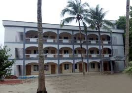
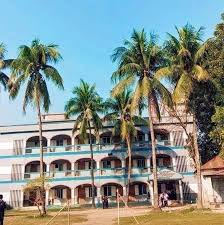

Skip to content
Search or jump to…

Pull requests
Issues
Marketplace
Explore
 
@shahinalam6701 
Learn Git and GitHub without any code!
Using the Hello World guide, you’ll start a branch, write comments, and open a pull request.

shahinalam6701
/
school
1
00
 Code Issues 0 Pull requests 0 Actions Projects 0 Wiki Security 0 Insights Settings
school
/
school.html
 

1
<!DOCTYPE html>
2
<html>
3
<head>
4
        <title>dhunat govt n u pilot model high school</title>
5
        <link rel="stylesheet" type="text/css" href="school.css">
6
        <link rel="stylesheet" type="text/css" href="img.css">
7
        
8
    </head>
9
    <body>
10
    
Dhunat Govt N. U. Pilot Model  high school::

11
<ul>
12
    <li><a href="#">home</a></li>
13
    <li class="dropdown">
14
    <a href="#">blog</a>
15
    

16
      <a href="#">Annual Exam test result</a>  
17
      <a href="#">pre-test result</a>  
18
      <a href="#">Half yearly exam result</a>  
19
      <a href="#">Photo gallary</a>  
20
    

21
    </li>
22
    <li><a href="#">education system</a></li>
23
    <li><a href="#">playground</a></li>
24
    <li><a href="#">sports</a></li>
25
    <li><a href="#">stay with us</a></li>
26
</ul>
27

28
​
29

30

About the school:

31
 
32

This is the current trend. Yu, the pilot model has been established as the current location of the high power indohani event 12. Girish Chandra, a resident of Dhunat Prana Para, appeared to be a pioneer in establishing computer-based electricity. Incredibly duplicate personal levels of bizarre personal assistant Dhunat Sadar Sanctuary do the double in the partition of literature on Babu Yudhisthira's headquarters. Ideally Model Free Primary,Dhunat Dak Bangla Mr. Rajeev Stimulation, L, A-Bogra, on January 7, passed the M-Middle (Hilshe), received the Imam's electricity called H-E Corner, which Dhunat has long-hailed. Seminar Sebi and Danbir Matikawara resident Na Umuddin Talukder (NUU) 20 ThreeHe assisted in the construction of the school's physical infrastructure by donating 20 percent of the acre and 20 / cash. Earlier, the school was granted higher education by the University of Calcutta in 1/3/1. Other donors and locally respected persons for the name of Dhunat Naeem Uddin High English name are: Babu Naresh Chandra Sarkar, 2 Jagadish Chandra Sarkar. Tamiz Uddin Sarkar etc.
33
.

34
​
35
​
36
​
37
​
@shahinalam6701
Commit changes
Commit summary
Update school.html
Optional extended description
Add an optional extended description…
 Commit directly to the master branch.
 Create a new branch for this commit and start a pull request. Learn more about pull requests.
 
© 2020 GitHub, Inc.
Terms
Privacy
Security
Status
Help
Contact GitHub
Pricing
API
Training
Blog
About
You are unauthorized on Surfe.be

×
Sign inSign up
